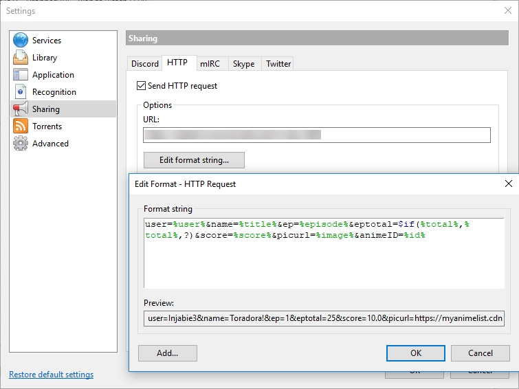

# Anime Now Playing Script
A simple PHP script to update your now playing anime from various sources, including:
- [MALUpdater](http://www.malupdater.com/)
- [Taiga](https://taiga.moe/)
- [Plex](https://plex.tv/) (Requires Plex Pass)

It can be used to public display your now playing on your website
(e.g. [my profile](https://injabie3.moe)).

# Set Up
## Script Set Up
- Create the table to store data using the SQL script on MySQL.
- Create `anime-nowplaying-config.php` from the sample config file, and modify the config to
  specify the config for your system.
- Upload `anime-nowplaying*.php` to your local or publicly accessible web server. As this is
  a simple script, it is recommended to:
  - Change the filename to something different to prevent spam.
  - Set file permissions for your config to `0640` or `0644`.
- Send HTTP POST requests to the URL in which this PHP file is located.

## Taiga Set Up
- In Settings > Sharing > HTTP, enable "**Send HTTP request**, and specify the full URL to the
  PHP file. It can be local or publicly accessible. Include the `code` and `updateMode` query
  strings.
- Change the format string as follows:
``user=%user%&name=%title%&ep=%episode%&eptotal=$if(%total%,%total%,?)&score=%score%&picurl=%image%&animeID=%id%``

## Plex Set Up
- Ensure you have purchased a Plex Pass.
- Open Plex on your browser, and head to Settings > Webhooks.
- Specify the full URL to the PHP file. It can be local or publicly accessible. Include the
  `code` and `updateMode` query strings.
